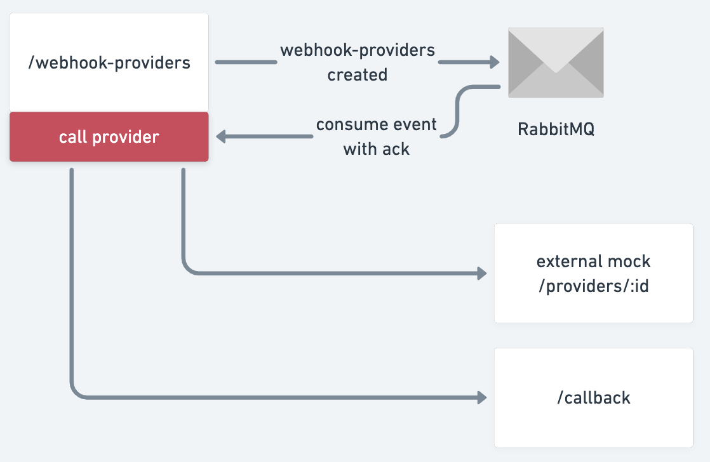

# Running 

1. `npm install` to install all the required libraries 
2. `docker-compose up -d` to bootstrap all the required services
3. `npm start` to start the main codebase
4. run `curl --location --request POST 'localhost:5000/webhook-providers' --header 'Content-Type: application/json' --data-raw '{"provider": "gas", "callbackUrl": "http://localhost:8000/"}'`

You can also access the RabbitMQ management portal [here](http://localhost:8080) after you run step number 2 successfully. (username: guest, password: guest)

# Problem description

This is a solution to [this](https://bitbucket.org/wonderbill/datahog/src/master/) problem that was sent to me by WonderBill.  
The problem is as follows: WonderBill integrates with various endpoints. These endpoints can return false-negative responses due to load, maintenance, etc. The goal is to build an async webhook that calls these endpoints and, when the response is successful, calls a successful callback.

# Proposed solution

This implementation uses RabbitMQ to retry the failed requests. 

The architecture is:



With the following flow:

1. POST `/webhook-providers` endpoint with the following contract
```
{
  provider: 'gas' | 'internet';
  callbackUrl: string;
}
```
2. RabbitMQ receives a `webhook-providers created` message with the data of the previous request
3. RabbitMQ assigns the message to an available consumer, which calls the provider and the callbackUrl. If either the provider or the callback are unavailable, the consumer does not acknowledge the message and RabbitMQ assigns it to another consumer to try again.

This was done in a single repository, with strict separation of concerns on the multiple layers of abstration used, meaning that it will be easy to convert it into a microservice architecture when it scales, with little code refactoring needed. Part of the code structure was inspired by a framework named [FeathersJs](https://feathersjs.com/) and functional programming principles.

The service layer is quite opinionated as well, ensuring consistency across the codebase if more services are added. This, combined with the aforementioned functional programming principles, means that all the code is highly reusable. 
This is how services are defined in this codebase:

```
export interface WebhookProviders {
  provider: 'gas' | 'internet';
  callbackUrl: string;
}

export const webhookProvidersService = service<WebhookProviders>({
  name: 'webhook-providers',
  create: [
    validateDataFieldHook('provider', existsValidator, 'provider is a required field'),
    validateDataFieldHook('provider', oneOfValidator(['gas', 'internet']), 'provider can only be either \'gas\' or \'internet\''),
    validateDataFieldHook('callbackUrl', existsValidator, 'callbackUrl is a required field'),
    publishToQueueHook('created')
  ],
  created: [
    callProviderEndpointHook,
  ]
});
```

# Future improvements

Due to the limited time, some things were left out:

1. Hardcoded urls. Environment variables should be used in order to point from the mocks to the actual services
2. Tweaking the RabbitMQ queues better
3. Integration tests on the service layer, to cover all possible edge-cases
4. Perfecting the `callProviderEndpointHook` to cover important edge-cases like the one where the callbackUrl is not valid.